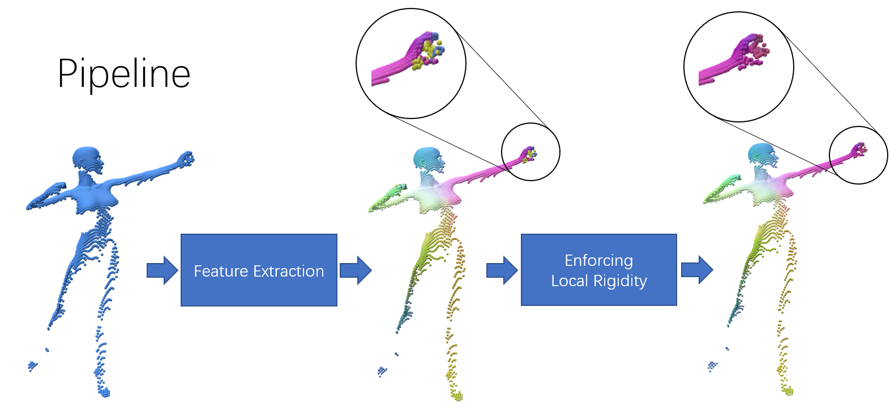

# Dense Human Correspondence via Learning Transformation Synchronization on Graphs

Pytorch implementation of Our Neurips 2020 paper

**Dense Human Correspondence via Learning Transformation Synchronization on Graphs** [(pdf)](https://www.cs.utexas.edu/~xrhuang/publications/Neurips2020_HumanCorres.pdf)

We demonstrate the steps to reproduce our results as well as providing pre-computed correspondence results and error statistics.

# [Dependencies](./dependencies.md)

# [Reproducing Experimental Results on Human Shapes](./docs/human/README.md)
Here we demonstrate the full pipeline to reproduce our approach.

# [Pre-computed Correspondence Results and Error Statistics](./docs/human/stats.md)
Here we provide a convenient link to download pre-computed results on `SHREC19-Human` and `FAUST` dataset. 

# [Reproducing Experimental Results on Animal Shapes](./docs/animals/README.md)
This is an additional experiment to test our approach's generalizability on non-human shapes.

# Contact

Please send any questions regarding this code to Xiangru Huang (`xiangruhuang816 [at] gmail [dot] com`).

