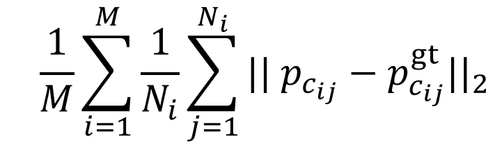

Here we illustrate how to reproduce our experiments for human shapes. We split our guide into three branches.

# 1. [Prepare SMPL Deformation Model](./smpl.md)

# 2. [Training](./training.md)
We provide instructions to train our model. For evaluation only users, this can be skipped.

# 3. Download Pretrained Models
Run the following command under folder `data` to download and set up the checkpoint folder `data/ckpt`.
```
wget https://www.dropbox.com/s/fmo3cz3lkcs9v41/pretrained_ckpt.tar.bz2
tar xvjf pretrained_ckpt.tar.bz2
```

# 4. [Evaluation](./evaluation.md)
We provide instructions to evaluate a trained model (either from step 2 or 3) on `SHREC19-Human` and `FAUST` datasets.

# 5. [Computed Correspondence and Error Statistics for SHREC19 and FAUST](./stats.md)
We provide the link to download the computed correspondence results and error statistics using our methods on `SHREC19-Human` and `FAUST` datasets.
This does not depend on any previous steps.

# 6. Evaluation Results
<table>
  <tr>
    <th>Mesh-to-Mesh Task</th>
    <td colspan="3"> SHREC19-Human </td>
    <td colspan="3"> FAUST Inter-Subject </td>
    <td colspan="3"> FAUST Intra-Subject </td>
  </tr>
  <tr>
        <td> </td>
        <td width="0.5"> Avg. Err. </td>
        <td> 5cm-recall </td>
        <td> 10cm-recall </td>
        <td> Avg. Err. </td>
        <td> 5cm-recall </td>
        <td> 10cm-recall </td>
        <td> Avg. Err. </td>
        <td> 5cm-recall </td>
        <td> 10cm-recall </td>
  </tr>
  <tr>
        <td> 3DCODED </td>
        <td> 6.69cm </td>
        <td> 74.0% </td>
        <td> 89.8% </td>
        <td> 2.08cm </td>
        <td> 95.6% </td>
        <td> 98.3% </td>
        <td> 1.97cm </td>
        <td> 96.4% </td>
        <td> 98.6% </td>
  </tr>
  <tr>
        <td> LES-PTD3 </td>
        <td> 6.75cm </td>
        <td> 74.2% </td>
        <td> 89.4% </td>
        <th> 1.64cm </th>
        <th> 96.9% </th>
        <th> 99.2% </th>
        <td> 1.49cm </td>
        <td> 97.6% </td>
        <td> 99.2% </td>
  </tr>
  <tr>
        <td> LES-PT10 </td>
        <td> 6.95cm </td>
        <td> 73.3% </td>
        <td> 89.5% </td>
        <td> 1.69cm </td>
        <td> 97.1% </td>
        <td> 99.1% </td>
        <th> 1.45cm </th>
        <th> 97.6% </th>
        <th> 99.2% </th>
  </tr>
  <tr>
        <td> LES-PT10 </td>
        <th> 5.02cm </th>
        <th> 76.6% </th>
        <th> 94.8% </th>
        <td> 2.05cm </td>
        <td> 94.9% </td>
        <td> 97.8% </td>
        <td> 2.32cm </td>
        <td> 94.9% </td>
        <td> 97.1% </td>
  </tr>
  <tr>
        <td> Deep GeoFunc </td>
        <td> 17.02cm </td>
        <td> 44.0% </td>
        <td> 72.7% </td>
        <td> 2.92cm </td>
        <td> 82.8% </td>
        <td> 97.2% </td>
        <td> 2.11cm </td>
        <td> 88.6% </td>
        <td> 97.5% </td>
  </tr>
  <tr>
        <th> Ours + Reg. + ICP </th>
        <th> 3.49cm </th>
        <th> 82.5% </th>
        <th> 96.5% </th>
        <th> 1.64cm </th>
        <th> 96.6% </th>
        <th> 99.1% </th>
        <th> 1.37cm </th>
        <th> 97.4% </th>
        <th> 99.3% </th>
  </tr>
  
</table>

The metric for computing correspondence error is shown below, where M is the number of target meshes, 𝑁<sub>𝑖</sub> is the number of vertices on the 𝑖-th target mesh and 𝑐<sub>𝑖𝑗</sub> is the corresponding vertex index on the 𝑖-th target mesh from the i-th source shape (point cloud or mesh).
      

